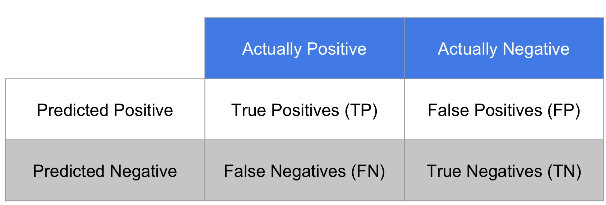
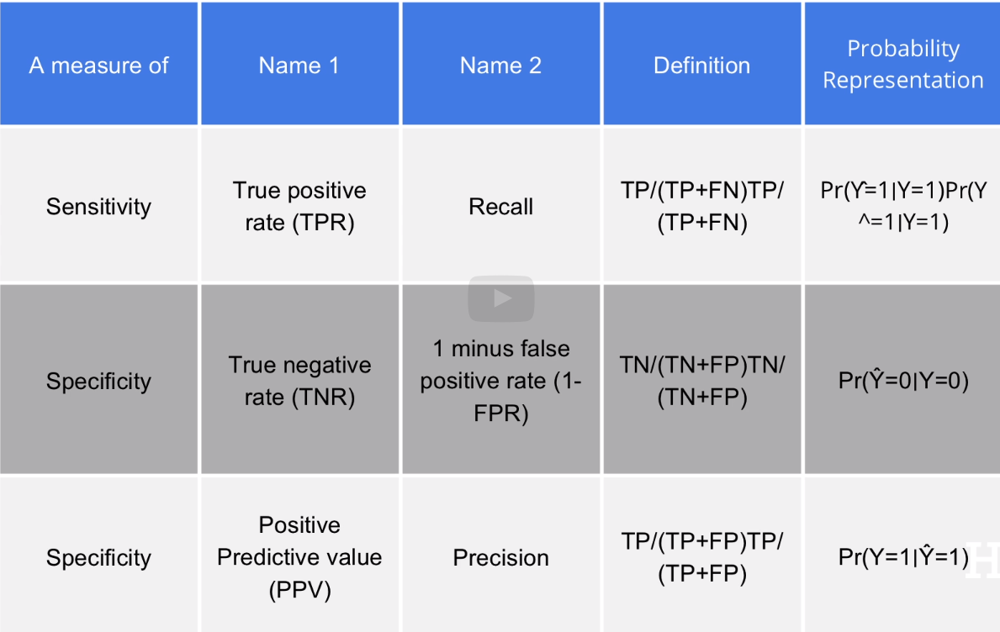

Inicializa o dataset e as bibliotecas
```{r}
library(caret)
library(dslabs)
library(dplyr)
library(purrr)

data(heights)
```
Mapeia os outcomes e as features
```{r}
y <- heights$sex
x <- heights$height
```
Divide o dataset
```{r}
set.seed(2,
         sample.kind = "Rounding")
limite <- createDataPartition(y, times=1, p=0.5, list=FALSE)
train_set <- heights[-limite, ]
test_set <- heights[limite, ]
```

Podemos usar "Overall accuracy" como o (número de acertos) / (total de linhas)
Isso serve para comparar modelos, como exemplo vamos criar dois modelos:
O primeiro, sendo um "chute"
```{r}
y_hat <- sample(c('Male', 'Female'), length(limite), replace=TRUE) %>% factor(levels = levels(test_set$sex))
```

Tendo uma "overall accuracy" de:
```{r}
mean(y_hat == test_set$sex)
```
Como, em média, homens são mais altos que mulheres, podemos melhorar essa acurácia de ~50%:
```{r}
heights %>% group_by(sex) %>% summarize(mean(height), sd(height))
```
Dessa forma, podemos prever "Male" se a altura estiver entre 2sd da altura média de homens, e mulher caso contrário:
```{r}
y_hat <- ifelse(x > 62, 'Male', 'Female') %>% factor(levels = levels(test_set$sex))
mean(y_hat == test_set$sex)
```
Vemos uma melhoria de ~50% de acertos para ~75%. Mas resta uma duvida, qual o melhor ponto de quebra?
```{r}
quebras <- seq(61, 70)
precisao <- map_dbl(quebras, function(x) {
  y_hat <- ifelse(train_set$height > x, 'Male', 'Female') %>% factor(levels = levels(train_set$sex))
  mean(y_hat == train_set$sex)
})
```
Podemos então plotar um gráfico com as precisões:
```{r}
data.frame(quebras, precisao) %>%
  ggplot(aes(quebras, precisao)) +
  geom_point() +
  geom_line()
max(precisao)
```
E podemos testar a quebra com melhor acurácia no database de teste:
```{r}
best_cutoff <- quebras[which.max(precisao)]
best_cutoff
```
```{r}
y_hat <- ifelse(test_set$height > best_cutoff, "Male", "Female") %>%
        factor(levels = levels(test_set$sex))
y_hat <- factor(y_hat)
mean(y_hat == test_set$sex)
```
Por outro lado, a "overall accuracy" pode enganar. No exemplo anterior, por exemplo, o modelo categorizava pessoas com
mais de 64 polegadas como homens, mesmo que mulheres tenham em média 65 polegadas. Podemos medir isso com a *matriz de
confusão*:
```{r}
table(predicted = y_hat, actual = test_set$sex)
```
Assim podemos ver que mais da metade das mulheres foram consideradas como homens. Calculando a acurácia por sexo temos
uma precisão muito baixa para mulheres:
```{r}
test_set %>%
        mutate(y_hat = y_hat) %>%
        group_by(sex) %>%
        summarize(accuracy = mean(y_hat == sex))
```
Então, por que a acurácia ficou tão alta? Pela *prevalência* de homens no dataset, fazendo com que a precisão para
mulheres tenha um baixo impacto na precisão geral.

Por esse motivo, não podemos olhar apenas para a precisão geral do modelo e temos que usar outras métricas, as quais
costumam ser derivadas da matriz de confusão. Uma forma geral de melhorar isso é usar a *sensitividade* e a
*especificidade* separadamente.

Para essas definições, precisamos de uma saída binária. Com modelos categóricos, podemos usar *prever a saída como
determinada categoria* como saída. No exemplo de alturas, podemos criar uma saída *prever como homem*. Sensitividade
é definida como a habilidade de um modelo ter a saída (prever como homem) positiva, quando o registro real é
positivo.

Entretanto, como um algoritmo que sempre retorne positivo tem uma sensitividade perfeita, temos que medir a
habilidade do algoritmo de ter a saída negativa, quando o registro real for negativo. Isso é a especificidade.

Uma matriz de confusão sempre segue o seguinte modelo:


Matematicamente, sensitividade é calculada como TP / (TP + FN) e especificidade como TN / (TN + FP).

A sensitividade também pode ser chamada de true positive rate (TPR) ou recall enquanto a especificidade pode ser
chamada de true negative rate (TNR)

A especificidade também pode ser definida como o a proporção de acertos positivos em relação as previsões positivas.
Essas medidas podem ser vistas na tabela abaixo:



O pacote caret define uma função que nos da a matriz de confusão e métricas discutidas:
```{r}
confusionMatrix(data = y_hat, reference = test_set$sex)
```
Uma métrica comumente usada para medir um modelo é a média harmônica entre especificidade e sensitividade, chamada de
*Acurácia balanceada* tambem chamado de *F1 score*. Em alguns casos, um falso positivo é pior do que um falso
negativo, ou vice versa. Por exemplo, prever erroneamente que um avião vai cair é mais aceitável do que prever
que ele não irá cair erroneamente. Para compensar isso, podemos usar um parametro (β) que mede o quão mais importante
a sensitividade (falsos negativos) é comparada com a especificidade (falsos positivos).

Podemos recalcular nosso modelo usando o F1 score ao invés da overall accuracy:
```{r}
cutoff <- seq(61, 70)
F_1 <- map_dbl(cutoff, function(x){
  y_hat <- ifelse(train_set$height > x, "Male", "Female") %>%
          factor(levels = levels(test_set$sex))
  F_meas(data = y_hat, reference = factor(train_set$sex))  # F_meas calcula o F1 score com beta=1
})
```
Novamente, podemos plotar as acurácias:
```{r}
data.frame(cutoff, F_1) %>%
  ggplot(aes(cutoff, F_1)) +
  geom_point() +
  geom_line()
```
E temos que a maior precisão é
```{r}
max(F_1)
```
Com o valor limite sendo:
```{r}
best_cutoff <- cutoff[which.max(F_1)]
best_cutoff
```
E podemos recalcular a especificidade e sensitividade desse novo modelo:
```{r}
y_hat <- ifelse(test_set$height > best_cutoff, "Male", "Female") %>%
        factor(levels = levels(test_set$sex))
sensitivity(data = y_hat, reference = test_set$sex)
specificity(data = y_hat, reference = test_set$sex)
```
Por outro lado, a prevalência importa. Se a prevalência for muito próxima de 0 ou 1, uma sensitividade e especificidade
altas não são relevantes. Por exemplo, em uma doença que acomete 1 a cada 5000 pessoas, ter uma sensitividade alta
implica que um paciente doente tem grandes chances de ser identificado como doente, e uma especificidade alta, que um
paciente saudável tem grandes chances de ser identificado como saudável, mas nenhuma dessas medidas indica que o número
de falsos negativos comparado com as previsões de positivo pode ser extremamente alta:

|          | Doente | Saudável |
|----------|--------|----------|
| Doente   | 5      | 10       |
| Saudável | 0      | 24975    |

Nesse exemplo, temos uma especificidade de 0.99959 e uma sensibilidade de 1, mas ainda assim existem mais falsos
positivos do que positivos verdadeiros.


Para comparar modelos independente de parâmetros, podemos usar a curva ROC (receiver operating characteristic).
Essa curva plota a sensitividade (taxa de positivos previstos como positivos) contra 1 - especificidade (taxa de
negativos previstos como positivos):
```{r}
probs <- seq(0, 1, length.out = 10)
guessing <- map_df(probs, function(p){
  y_hat <-
          sample(c("Male", "Female"), length(limite), replace = TRUE, prob=c(p, 1-p)) %>%
                  factor(levels = c("Female", "Male"))
  list(method = "Guessing",
       FPR = 1 - specificity(y_hat, test_set$sex),
       TPR = sensitivity(y_hat, test_set$sex))
})
guessing %>% qplot(FPR, TPR, data =., xlab = "1 - Specificity", ylab = "Sensitivity")

cutoffs <- c(50, seq(60, 75), 80)
height_cutoff <- map_df(cutoffs, function(x){
  y_hat <- ifelse(test_set$height > x, "Male", "Female") %>%
          factor(levels = c("Female", "Male"))
  list(method = "Height cutoff",
       FPR = 1 - specificity(y_hat, test_set$sex),
       TPR = sensitivity(y_hat, test_set$sex))
})

# plot both curves together
bind_rows(guessing, height_cutoff) %>%
        ggplot(aes(FPR, TPR, color = method)) +
        geom_line() +
        geom_point() +
        xlab("1 - Specificity") +
        ylab("Sensitivity")
```
Uma boa prática é indicar quais são os valores limites em cada ponto:
```{r}
library(ggrepel)
map_df(cutoffs, function(x){
  y_hat <- ifelse(test_set$height > x, "Male", "Female") %>%
          factor(levels = c("Female", "Male"))
  list(method = "Height cutoff",
       cutoff = x,
       FPR = 1 - specificity(y_hat, test_set$sex),
       TPR = sensitivity(y_hat, test_set$sex))
}) %>%
        ggplot(aes(FPR, TPR, label = cutoff)) +
        geom_line() +
        geom_point() +
        geom_text_repel(nudge_x = 0.01, nudge_y = -0.01)
```
A interpretação que temos é que quanto mais próximo do gráfico de f(x) = 1 melhor é o modelo. Isso por que queremos
um modelo que, para poucos falsos positivos, tenha um grande número de positivos verdadeiros.

Um problema da curva ROC é que ela desconsidera a prevalência. Quando a prevalência for importante, podemos usar
a precisão ou PPV como medida de especificidade:
```{r}
guessing <- map_df(probs, function(p){
  y_hat <- sample(c("Male", "Female"), length(limite),
                  replace = TRUE, prob=c(p, 1-p)) %>%
          factor(levels = c("Female", "Male"))
  list(method = "Guess",
       recall = sensitivity(y_hat, test_set$sex),
       precision = precision(y_hat, test_set$sex))
})

height_cutoff <- map_df(cutoffs, function(x){
  y_hat <- ifelse(test_set$height > x, "Male", "Female") %>%
          factor(levels = c("Female", "Male"))
  list(method = "Height cutoff",
       recall = sensitivity(y_hat, test_set$sex),
       precision = precision(y_hat, test_set$sex))
})

bind_rows(guessing, height_cutoff) %>%
        ggplot(aes(recall, precision, color = method)) +
        geom_line() +
        geom_point()
```
A ideia é a mesma, ter a precisão mais alta possível, independentemente da taxa de positivos verdadeiros.